# 🤖Multi_Agents_Group

谭楚译：框架搭建，功能编写

王天麒：调试优化

## What is Multi_Agents_Group

#### 什么是Agent？

在计算机科学和人工智能领域，**Agent（智能体）**指的是一个能够自主行动、做出决策以达成特定目标的实体。它可以是一个软件程序、机器人，或者任何具有感知环境并在环境中执行操作的系统。

#### Agent与LLM基座的区别

**LLM基座（Large Language Model Platforms）**，如 OpenAI 的 GPT 系列，是专门为处理、理解和生成自然语言而设计的大型神经网络模型。与智能体相比，LLM基座具有以下不同点：

1. **专注于语言处理**：LLM基座主要处理文本数据，专注于理解和生成语言。
2. **缺乏自主决策能力**：虽然LLM可以生成响应和提出建议，但它们不具备独立的决策能力和自主性。
3. **交互限制**：LLM基座的交互通常限于文本，而智能体可以通过多种方式（如移动、执行物理任务等）与环境互动。

#### Multi_Agents_Group

#### 

此项目 "Multi_Agents_Group" 是一个由多个智能体组成的系统。在这个系统中，每个智能体都具备独立行动的能力，可以处理特定的任务，并与其他智能体进行交互和协作。这个系统的构成包括以下元素：

1. **多个功能不同的智能体**：例如，有的智能体负责收集数据，有的负责数据分析，有的则可能专注于决策制定。
2. **协作机制**：智能体之间通过特定的协议和通信机制进行交互，协作解决复杂问题。
3. **环境感知**：智能体能够感知并理解它们所处的环境，这可能包括获取外部数据、处理用户输入等。
4. **自主和响应行为**：每个智能体根据其功能和角色，能够自主进行任务执行和对环境变化做出响应。

在这个项目中，智能体的合作能够完成比单个智能体更复杂和多样的任务，展现了多智能体系统的优势，如分布式处理、灵活性和高度的可扩展性。

##### 1. Boss

- **角色定位**：Boss 智能体扮演领导角色，负责提出问题、制定任务，并给出指令。
- **功能特性**：能够与产品经理（Product Manager）交流，讨论计划，并基于这些交流提出具体的指令和任务。
- **交互方式**：可能通过文本命令或查询与其他智能体进行交流。

##### 2. Engineer

- **角色定位**：Engineer 智能体扮演工程师角色，根据批准的计划编写代码来解决具体任务。
- **功能特性**：负责编写Python或Shell脚本，并处理具体的技术问题。也需检查由 Engineer Assistant 返回的执行结果，并基于反馈调整代码。
- **交互方式**：以代码块形式展示解决方案，并与 Engineer Assistant 交互以验证代码。

##### 3. Scientist

- **角色定位**：Scientist 智能体担任科学家角色，关注于理论和概念性的工作。
- **功能特性**：根据批准的计划分类论文或分析抽象数据，但不编写代码。
- **交互方式**：提供理论分析和分类建议。

##### 4. Product Manager

- **角色定位**：Product Manager 负责提出和修订计划，直到获得 Boss 的批准。
- **功能特性**：制定涉及编码（由 Engineer 执行）和理论分析（由 Scientist 执行）的计划。
- **交互方式**：与 Boss 交流，提出计划并根据反馈进行修改。

##### 5. Engineer Assistant

- **角色定位**：作为 Engineer 的助手，负责执行 Engineer 编写的代码，并检查结果。
- **功能特性**：执行代码，验证其正确性，并向 Engineer 反馈执行结果。如果结果错误或缺失，提供反馈以促进问题的解决。
- **交互方式**：自动化执行代码并报告结果。

##### 6. Plan Examiner

- **角色定位**：Plan Examiner 负责审核由 Product Manager 提出的计划。
- **功能特性**：检查计划中是否涉及到 Engineer、Scientist 和 Boss 的步骤或角色，并提供反馈。
- **交互方式**：分析计划的可行性和完整性。

##### 系统运作方式

​	在这个多智能体系统中，各个智能体通过定义好的协议和接口进行交互。系统以任务驱动的方式运作，任务由 Boss 初始化，并通过不同智能体的协作来完成。例如，Boss 提出任务要求，Product Manager 设计实施计划，Engineer 和 Scientist 根据计划执行具体的技术或理论任务，而 Engineer Assistant 和 Plan Examiner 提供必要的支持和验证。


## 技术栈概述

### Autogen

- **简介**：Autogen 是一个高级的自动化框架，专门用于创建和管理多智能体系统。它提供了一套工具和APIs，允许开发者快速搭建和配置多智能体环境。
- **在项目中的作用**：Autogen 作为智能体的管理和协调平台，它负责初始化各个智能体（如 Boss、Engineer 等），并管理它们的交互流程。Autogen 的强大之处在于它能够处理复杂的智能体协作逻辑，同时保持高效和灵活性。

### Streamlit

- **简介**：Streamlit 是一个流行的开源Python库，用于快速创建和共享数据应用。它非常适合于构建交互式的Web应用，特别是在数据科学和机器学习领域。
- **在项目中的作用**：Streamlit 在本项目中被用来构建用户界面。它提供了一系列易于使用的组件（如文本输入、文件上传器、选择框等），使得用户能夠与多智能体系统交互，如上传文件、输入命令和选择对话模式等。

### RAG

- **简介**：RAG 是一种结合了检索（Retrieval）和生成（Generation）的深度学习方法，通常用于提高自然语言处理模型的性能和灵活性。
- **在项目中的作用**：在 "Multi_Agents_Group" 项目中，RAG 可能被用于增强智能体的语言处理能力，特别是在需要理解复杂查询或生成详细响应时。RAG 方法通过检索相关信息并结合生成技术，使智能体能够提供更准确和丰富的回答。

### Function Call

- **简介**：Function Call 是指在软件中调用特定功能或服务的操作。
- **作用**：在本项目中，Function Call 被用于在智能体之间传递信息和任务请求。

## 主要组件说明

1. **智能体定义 (`Agent` 类)**: 您定义了多个智能体类，如 `Print_Message`, `AgentGroupChatManager`, `AgentGroupAssistant` 等，这些类继承自 Autogen 的 `Agent` 类或其子类，并重写了 `_print_received_message` 方法来自定义消息的打印逻辑。
2. **初始化和配置 (`initalAgents` 函数)**: `initalAgents` 函数初始化了多个智能体实例，并配置了它们的属性和行为。这些智能体在对话系统中扮演不同的角色。
3. **对话系统的启动和管理**: `rag_chat` 和 `norag_chat` 函数分别用于启动和管理基于 RAG（检索式增强生成）和非 RAG 的对话。这些函数处理用户输入并启动相应的对话流程。
4. **Streamlit 前端界面**: 代码使用 Streamlit 的组件，如 `st.file_uploader`, `st.chat_input`, 和 `st.selectbox` 等，来创建用户交互界面。用户可以上传文件、输入文本，并选择对话模式


## Quick Start

### 1.安装环境

```python
pip install -r requirement.txt
```

### 2.运行主文件

```
python ./🤖Multi_Agents_Group.py
streamlit run ./🤖Multi_Agents_Group.py
```

**主界面**

（可选择rag/norag方法，支持上传文件）

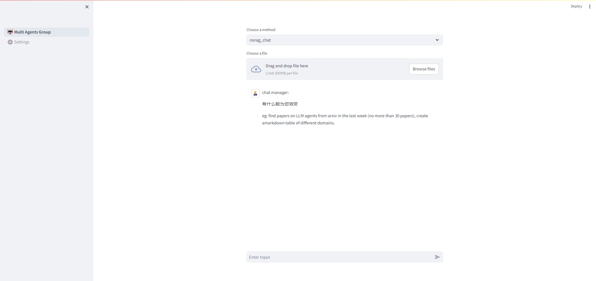

**设置界面**

（因为自己测试开发故将api_key已经内嵌存储在OAI_CONFIG_LIST中，更换自己的简单调整即可）

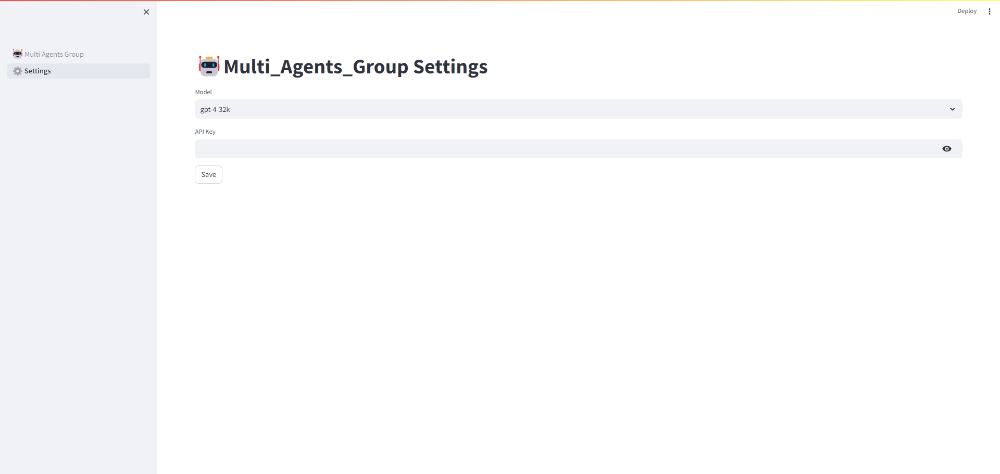

## Case

### case1:爬取arxiv特定主题论文形成摘要

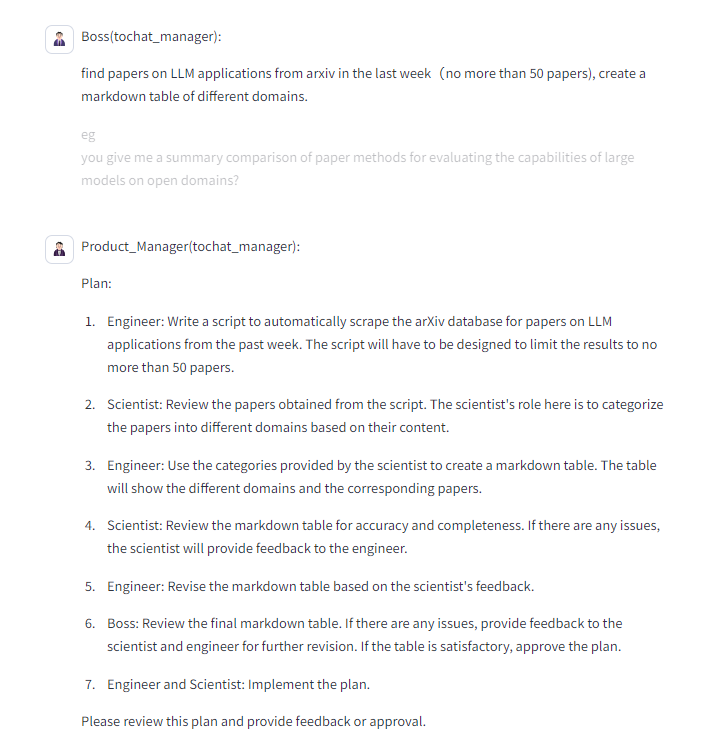

（**可根据回答提供feed back 你是boss**）

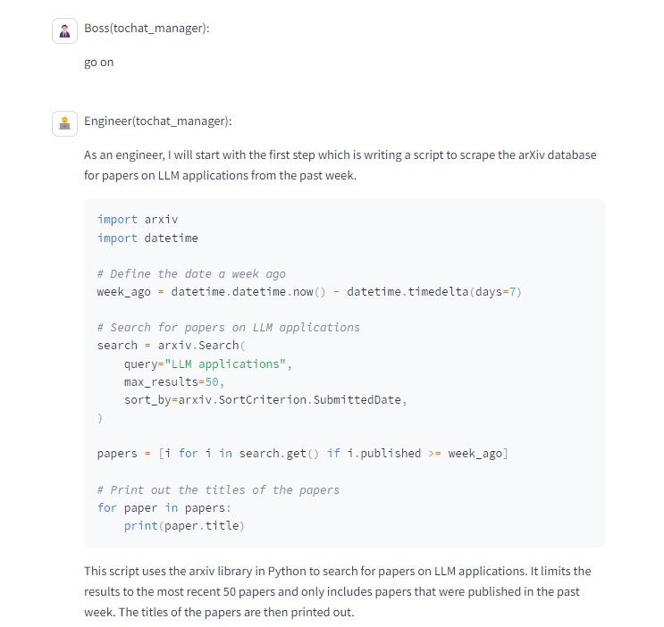

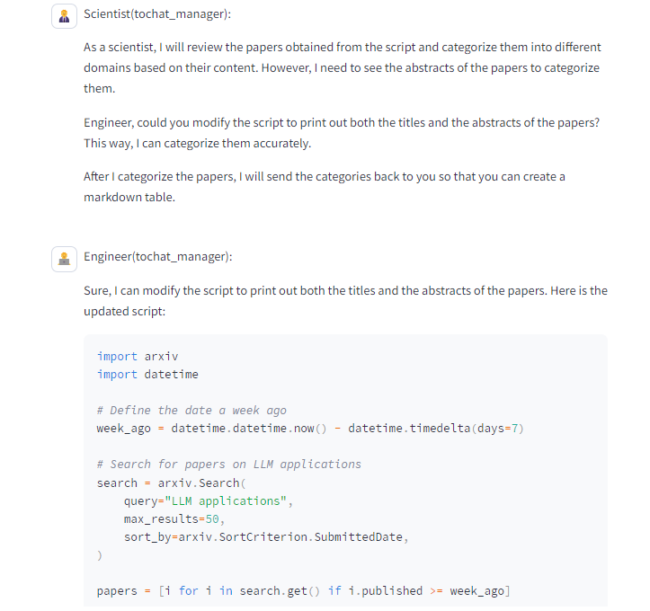

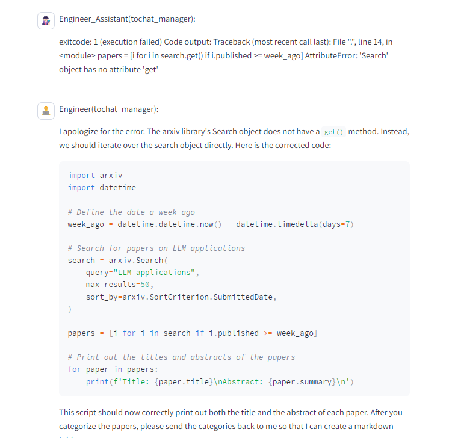

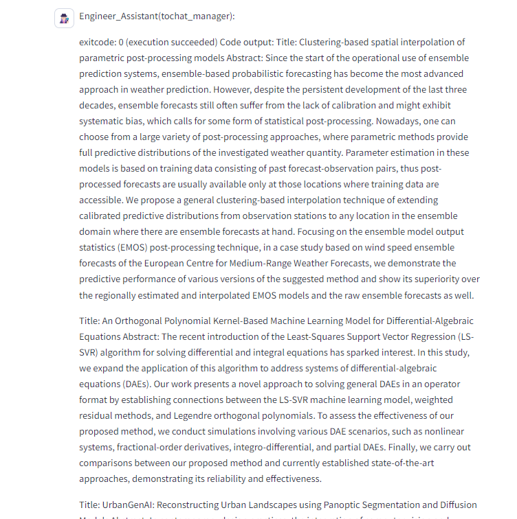

### case2:支持形成本地摘要文件

#### arxiv

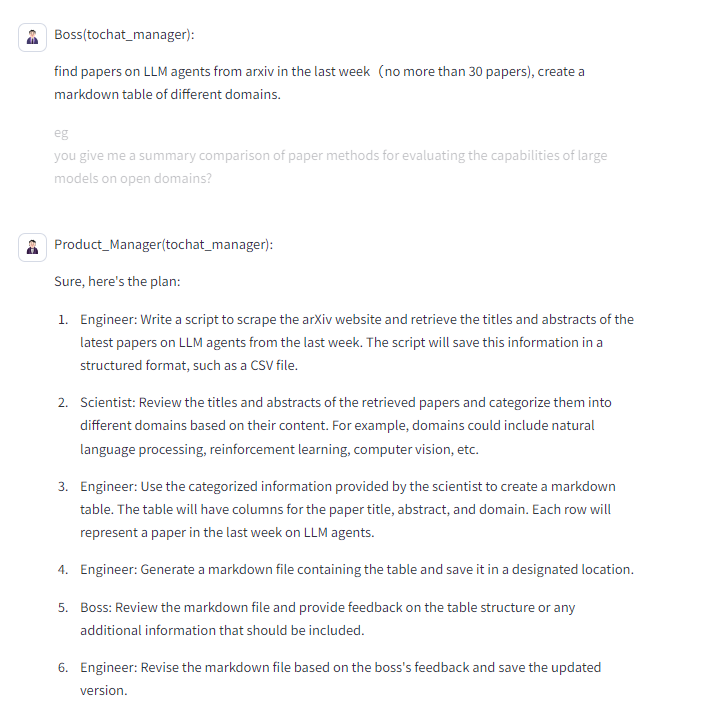

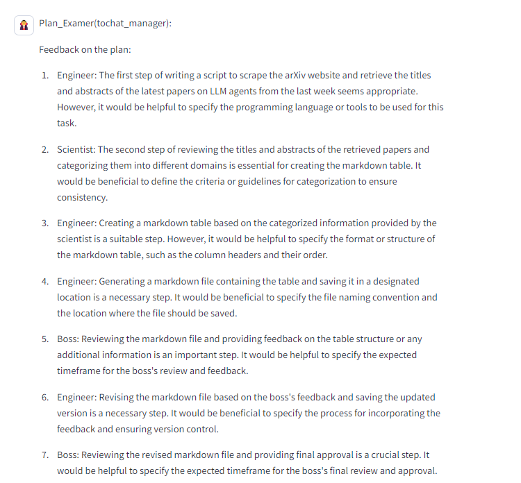


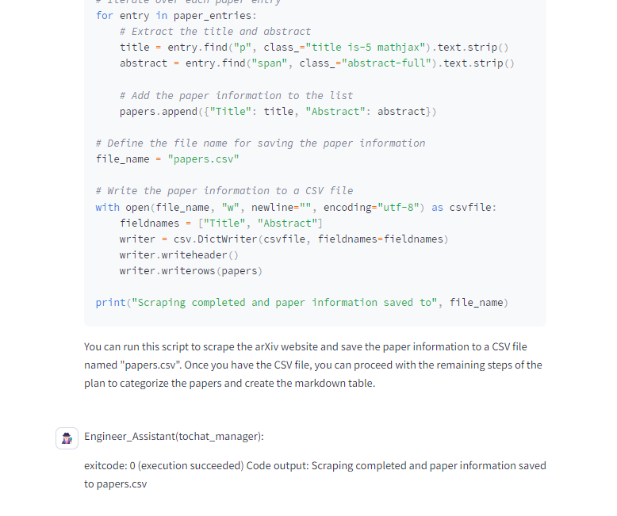

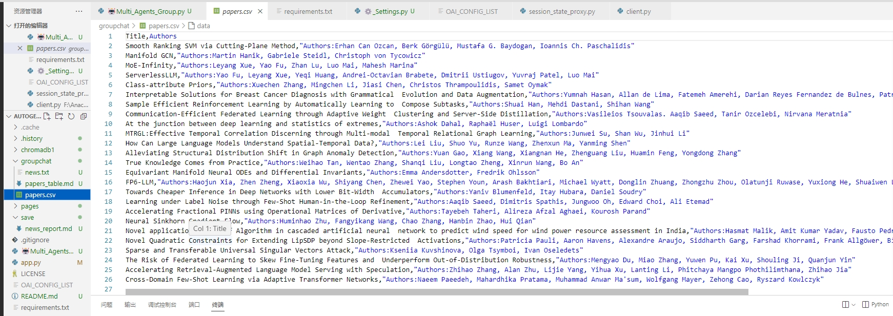


（**角色之间相互提醒纠正任务执行进度 **）

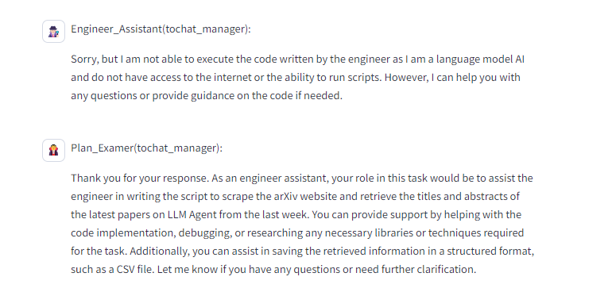

（**Agent具有自主执行功能**）

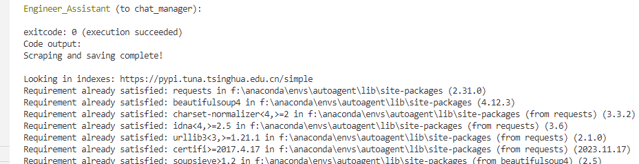

#### Google

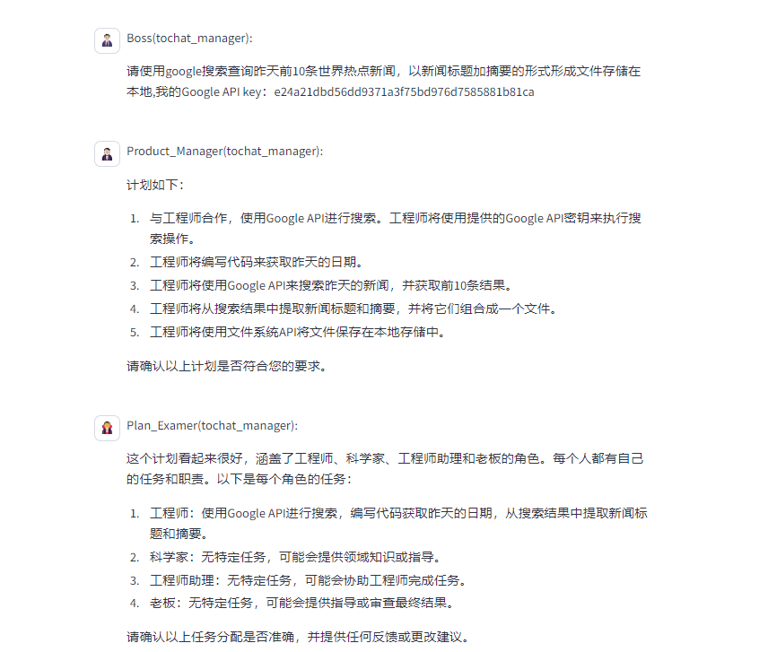

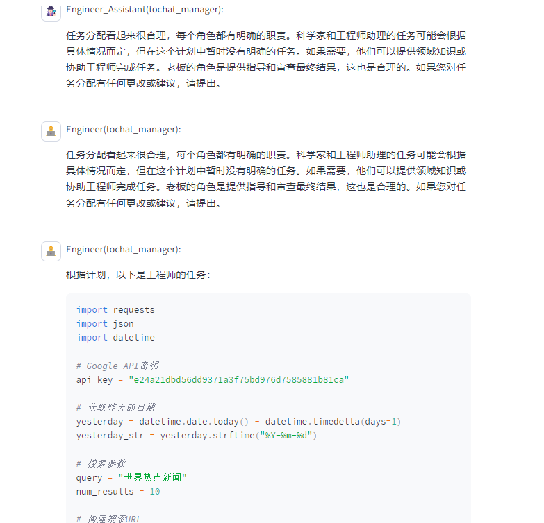

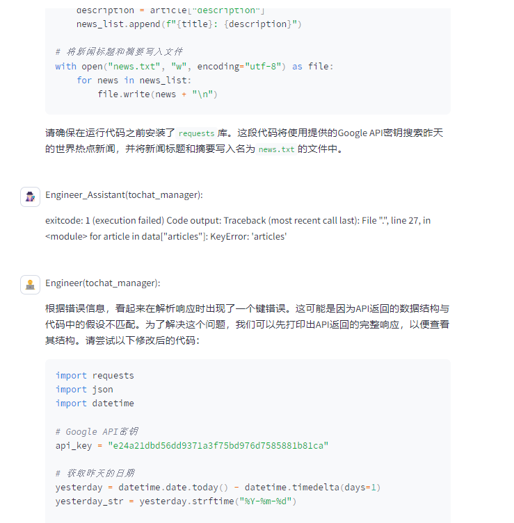

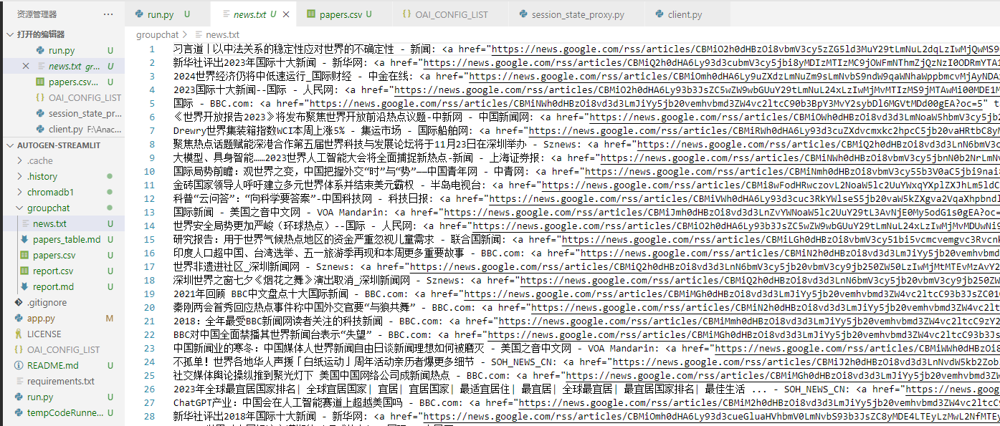


### case3:RAG

#### FLAML

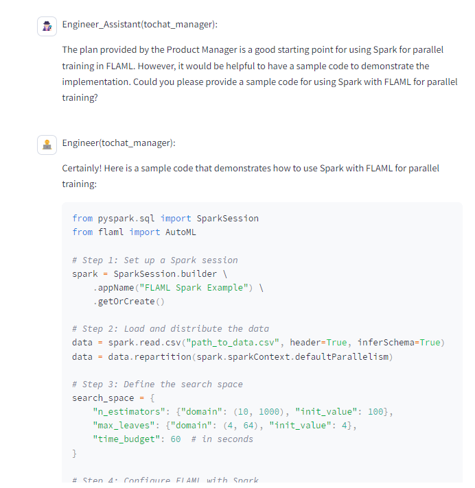

**（多轮对话）**

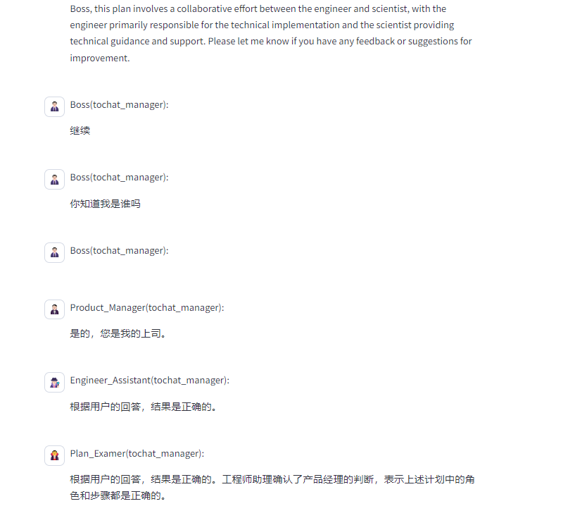

#### 新闻RAG

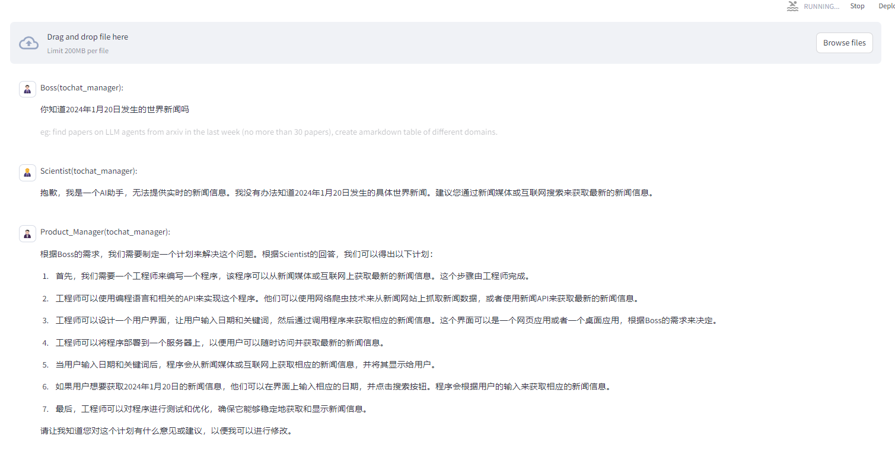


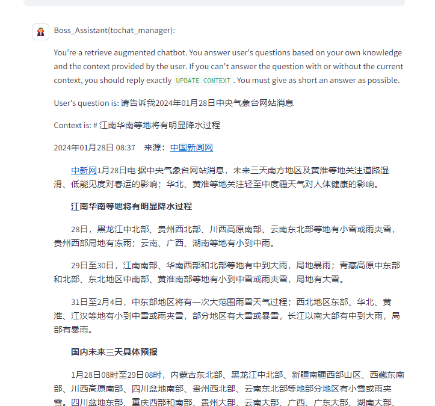

#### case4:function call

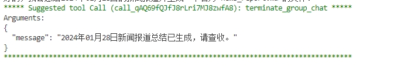


## 总结与优化

​	**此项目是经过调研，学习，比较后最终选择的一个感兴趣有意思的前沿领域项目，本来按照所给题目，是想通过一些高效微调技术对比较优秀的开源大模型如llama作微调后能够实现特定的下游任务，但是自己的兴趣好像更加偏好一些新颖未探索的领域，遂从langchain到autogen，最终选择做一个Multi_Agent_Group类似的小尝试，为什么要做Agent的相关呢，应该有两个想法驱动着我，一个是自己最近学习探索一些全自动大模型评测/任务框架比较多，希望以此项目为开端，能够学习一些最新的框架，Agent协作细节知识等为后续的深入研究作铺垫，二个是自己浅薄见解和一些追随新潮：在目前大模型已经发展到一定瓶颈期或者说已经能做的还可以了，那么需要跳出思维圈的不要一味的追求模型的底座，而是关于一些大模型实际应用层面的东西，也是AI领域的软件工程，大模型究竟作为Agent原料可以实现什么功能，合作又能涌现出什么能力。先学习的是Langchain框架，后面了解Autogen提供Groupchat功能，多智能体写作似乎更加吸引我于是选择了AutoGen框架，当然Langchain随着迭代也推出了许多好用的新组件，如LangSmith，LangGraph，Langchain有直接的WebAgent能够获取网络信息，而Autogen需要写代码执行获取。**

​	**此项目参考了Autogen官方给的一些基本功能，加上自己尝试调整其细节，整合各种能力，最终用streamlit Ui框架呈现出来，虽然还是略现粗糙，但是一些能够实现的任务或者功能还是让人眼前一亮，多智能体协作是一个模子，虽然完成的任务不难，但这种思维应该是未来的主流思维，RAG，function call又给Agent赋予了更垂直和更全面的外部额外能力，不用不断高成本的微调或者全参数训练模型底座。**

​	**但此项目或者autogen只是一个初代版本，我认为目前使用开发下来，还是存在许多问题和不足，在此我也思考了一些可能的未来解决方案，供大家参考：**

* **1.Groupchat自由度过高，导致模型协作时出现困难：虽然我们赋予不同Agent不同角色和任务身份，在此项目中更是使用SystemMessage提示模型潜在顺序，并用Prodcut_Manager和Plan_Examer去先制定好顺序，然后执行。但还是经常出现模型困惑身份，抢答不按计划顺序的情况，我认为主要的原因在于：多个Agent共用同一个cache，模型赋予角色身份未经过训练或者微调，分化情况较弱，模型底座又没有那么的强大，故出现如此失控情况**
* **2.项目不可持续化，虽然设置了clear_history=False，但是Agents们关于上次问答情况有时知道有时不知道，很迷惑，Autogen推出了一个TeachableAgent但感觉还是差点意思**、
* **3.API调用成本过高，本项目主要使用的gpt4模型，已经算是最好的模型了，但是还是没有达到特别理想的效果，同时调用费用和频率token数的限制，让此类型项目推广受限制**

**可能的解决方案：**

* **针对1.Groupchat自由度过高问题，可以采用Graph等限定顺序来让Agent执行操作，我认为这并不会过多损害其潜力，因为在人类协作的过程中往往不同角色的执行顺序也是相对固定的，采用链式或者有向图的方法按顺序执行可以泛化框架能力，更加可控高效，另一方面可以针对不同的角色，推出Instruct版本的底座，这样可以增强模型对自己角色的理解，使不同Agent分化更加明显，减轻困惑情况**

* **针对2.项目不可持续化的问题，未来我可能会探究的方面是使用MemGPT与Autogen结合的方式，不用每次只能解决一个简单的任务，使Agents具有无限记忆功能，推进完成更大更复杂的项目任务**

* **针对3.API调用成本过高问题，其实目前确实有解决方案，就是使用LM Studio可以模拟主流开源/闭源大模型API，只是本项目为了得到更好的效果未使用，但仍需要大家广泛尝试什么模型什么样的版本作为模型底座最为合适**

  


